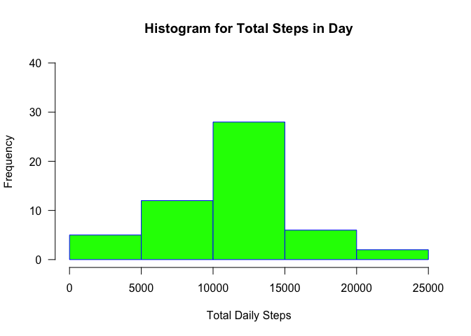
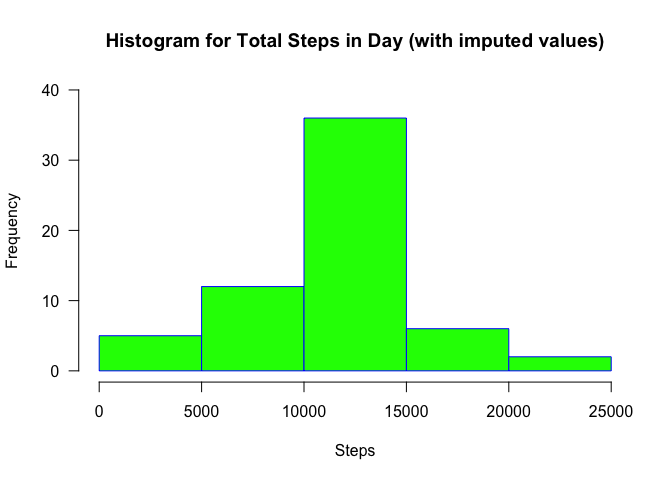

# Reproducible Research: Peer Assessment 1


## Loading and preprocessing the data

```r
## Load the data
activityDF <- read.csv("activity.csv", header=TRUE)

## Change class of the date column. 
activityDF$date <- as.Date(activityDF$date, format = "%Y-%m-%d")

## Load dplyr as we will be using summarize
library(dplyr)
```

```
## 
## Attaching package: 'dplyr'
```

```
## The following objects are masked from 'package:stats':
## 
##     filter, lag
```

```
## The following objects are masked from 'package:base':
## 
##     intersect, setdiff, setequal, union
```


## What is mean total number of steps taken per day?


```r
sum_steps_day <- aggregate(steps~date,activityDF,sum, na.action=na.pass)

hist(sum_steps_day$steps, 
     main="Histogram for Total Steps in Day", 
     xlab="Total Daily Steps", 
     border="blue", 
     col="green",
     ylim=c(0,40),
     las=1, 
     breaks=5)
```

\

```r
total_mean <- mean(sum_steps_day$steps, na.rm = TRUE)
total_median <- median(sum_steps_day$steps, na.rm = TRUE)
```

Mean number of steps taken per day is 10766.19

Median number of steps taken per day is 10765. 


## What is the average daily activity pattern?


```r
mean_interval_daily_steps <- aggregate(steps~interval, activityDF, mean)

plot(mean_interval_daily_steps$interval,
     mean_interval_daily_steps$steps,
     type="l",
     main="Average Number of Steps Per 5-Minute Interval", 
     xlab="5-Minute Interval (0 through 2355)",
     ylab="Average Number of Steps"
)
```

\

```r
max_interval <- mean_interval_daily_steps$interval[which.max(mean_interval_daily_steps$steps)]
```


The interval with the maximum number of steps on average across all the days in the dataset is 835

## Imputing missing values

The number of missing values in the dataset is 2304

```r
## Calculate and report the total number of missing values in the dataset
## (i.e. the total number of rows with 𝙽𝙰s)
sum(is.na(activityDF$steps))
```

```
## [1] 2304
```

####Strategy for Missing Values
My strategy is to use the mean across all days for a given interval in place of a missing value for that interval on a particular day.


```r
## Create a new dataset that is equal to the original dataset but with the missing
## data filled in.

imputedDF <- activityDF

## Strategy: go through all rows of imputedDF. If steps is NA for that interval, then find value of mean steps
## for that interval across all days and assign it in place of the NA in imputedDF.
for (i in 1:17568) {
        if (is.na(imputedDF$steps[i])) {
                imputedDF$steps[i] <- mean_interval_daily_steps[which(mean_interval_daily_steps$interval == imputedDF$interval[i]), ]$steps
        } 
}

## Make a histogram of the total number of steps taken each day
imputed_days_total_steps2 <- aggregate(steps~date, imputedDF, sum)

hist(imputed_days_total_steps2$steps, 
     main="Histogram for Total Steps in Day (with imputed values)", 
     xlab="Steps", 
     border="blue", 
     col="green",
     ylim=c(0,40),
     las=1, 
     breaks=5)
```

\

```r
imputed_total_mean2 <- mean(imputed_days_total_steps2$steps, na.rm = TRUE)
imputed_total_median2 <- median(imputed_days_total_steps2$steps, na.rm = TRUE)
```

The mean number of steps taken per day is 10766.19

The median number of steps taken per day is 10766.19

####Do these values differ from the estimates from the first part of the assignment? What is the impact of imputing missing data on the estimates of the total daily number of steps?

Adding the imputed values based on the average number of steps for each interval does not change the daily mean or median across the two month range. (Well, there was a small change in the median, which is now a fractional number of steps because we used the mean for the imputed step values.) However, imputing steps to days with missing data will obviosuly increase the total number of steps across the two month range and increase the number of steps in some ranges of our histogram.


## Are there differences in activity patterns between weekdays and weekends?

There are differences in activity patterns between the weekdays and weekends. It appears that the number of steps in the early morning is greater on the weekdays and more concentrated around the max point, perhaps when the subject was commuting to work. The weekend activity is spreadh throughout more of the afternoon and has increased acvitity in later hours of the evening.


```r
#create a vector of weekdays
weekdays1 <- c('Monday', 'Tuesday', 'Wednesday', 'Thursday', 'Friday')
#Use `%in%` and `weekdays` to create a logical vector
#convert to `factor` and specify the `levels/labels`
imputedDF$wDay <- factor((weekdays(imputedDF$date) %in% weekdays1), 
                   levels=c(FALSE, TRUE), labels=c('weekend', 'weekday')) 

#load lattice library
library(lattice)

#a lengthy approach, but was all I could think of
imputedDF_weekday <- group_by(filter(imputedDF, wDay == "weekday"), interval)
weekday_interval_total_steps <- summarize(imputedDF_weekday, mean_steps = mean(steps, na.rm = TRUE))
weekday_interval_total_steps$wDay <- "weekday"

imputedDF_weekend <- group_by(filter(imputedDF, wDay == "weekend"), interval)
weekend_interval_total_steps <- summarize(imputedDF_weekend, mean_steps = mean(steps, na.rm = TRUE))
weekend_interval_total_steps$wDay <- "weekend"

complete <- rbind(weekday_interval_total_steps,weekend_interval_total_steps)

xyplot(mean_steps ~ interval | wDay, data = complete, layout = c(1, 2), type="l")
```

\

